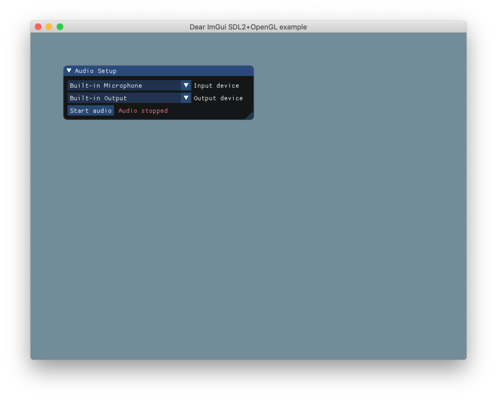

# pal: a C++ audio prototyping framework

*pal* is a C++ application framework for rapid prototyping of audio applications.

Since pal uses C++, it makes it easy to transition into a production
framework, such as JUCE, once you're happy with your prototype.

pal aims to come "batteries included" so you can get started making cool
prototypes without having to worry about the details. Because its low number
of dependencies and modular architecture, pal is easy to integrate with other
libraries and application frameworks.

## Installation (macOS)

Before using pal, make sure you have all the dependencies installed. These are:

* portaudio - for real time audio IO.
* libsndfile - for reading and writing audio files.
* SDL2 - for opening and managing windows and user IO.

On mac these can be installed using [homebrew](https://brew.sh/) with the command:

```
$ brew install portaudio libsndfile sdl2
```

Once all dependencies are installed you can try building the pal template by
running

```
$ make run
```

If the build is successful a window should open that looks like this:



If you have trouble building make sure that all the libraries are in path.
Otherwise please open a GitHub issue.

If everything runs like it should you can run

```
$ make install
```

which will install the pal command line tool on your system. The install
location defaults to */usr/local/bin*, but can be changed by setting the 
*INSTALL_LOCATION* variable in *makefile*.

## Using pal

Once pal is installed you can create a new pal application by first making
a directory where it can live

```
$ mkdir my-pal-project
$ cd my-pal-project
```

and the using the `new` command

```
$ pal new
```

This will copy the necessary files from the pal directory --- the one from which you
installed pal --- to your new project directory.

Now you can run `make run` to check that everything is working. You can then
start editing *main.cpp* however you like.